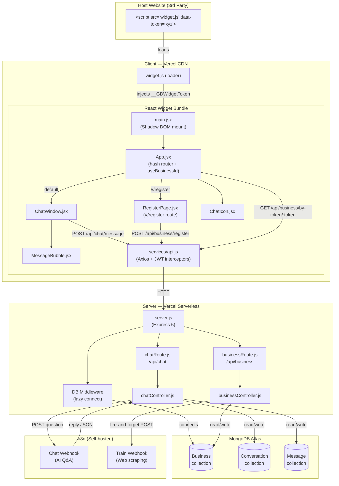

# GrowDigitally Chatbot — Full Project Analysis

> A comprehensive scan of both the **client** (React/Vite widget) and **server** (Express/MongoDB) covering architecture, API routes, data flow, missing requirements, and optimization opportunities.

---

## 1. Project Overview

GrowDigitally Chatbot is an **embeddable AI chat widget** that businesses install on their websites with a single `<script>` tag. The widget connects to an Express backend which proxies messages through an **n8n** automation workflow (the actual AI layer) and persists conversations in MongoDB.

| Layer | Technology | Deployment |
|---|---|---|
| Frontend Widget | React 19 + Vite 8 + Tailwind CSS v4 | Vercel (static CDN) |
| Backend API | Express 5 + Mongoose 9 | Vercel (serverless functions) |
| Database | MongoDB Atlas | Cloud (Atlas free tier) |
| AI / Automation | n8n webhook workflows | Self-hosted (`n8n.kasunpremarathna.com`) |

---

## 2. Directory Structure

```
GrowDigitally-Chatbot/
├── client/                          # React frontend (Vite widget build)
│   ├── index.html                   # Entry HTML (mounts #root)
│   ├── vite.config.js               # Vite + Tailwind + single-file output config
│   ├── package.json
│   ├── .env                         # VITE_REACT_APP_BACKEND_URL
│   └── src/
│       ├── main.jsx                 # Widget bootstrap — Shadow DOM + token injection
│       ├── App.jsx                  # Root component — hash router + businessId hook
│       ├── index.css                # Widget-scoped CSS + Tailwind + Google Fonts
│       ├── components/
│       │   ├── ChatIcon.jsx         # Floating action button (FAB)
│       │   ├── ChatWindow.jsx       # Main chat panel (messages, input, quick-replies)
│       │   ├── MessageBubble.jsx    # Single message bubble (user / AI)
│       │   └── RegisterPage.jsx     # Business sign-up form + success screen
│       ├── services/
│       │   └── api.js               # Axios instance (baseURL, JWT interceptors)
│       ├── assets/                  # Static assets (images, icons)
│       └── UI/
│           └── code.html            # Standalone HTML demo / embed guide
│
└── server/                          # Express backend (Vercel serverless)
    ├── server.js                    # App entry — CORS, middleware, route mount
    ├── vercel.json                  # Vercel serverless routing config
    ├── package.json
    ├── .env                         # Secrets (MongoDB URI, n8n URLs, widget URL)
    ├── config/
    │   └── db.js                    # Mongoose connection (lazy/singleton)
    ├── routes/
    │   ├── chatRoute.js             # /api/chat routes
    │   └── businessRoute.js         # /api/business routes
    ├── controller/
    │   ├── chatController.js        # sendMessage, getMessages logic
    │   └── businessController.js   # registerBusiness, getBusinessByToken logic
    └── models/
        ├── Business.js              # Business Mongoose schema
        ├── Conversation.js          # Conversation Mongoose schema
        └── Message.js               # Message Mongoose schema
```

---

## 3. Architecture Diagram



---

## 4. API Routes Reference

### Chat Routes — `/api/chat`

| Method | Path | Controller | Description |
|---|---|---|---|
| `POST` | `/api/chat/message` | `sendMessage` | Sends user message → n8n → returns AI reply; persists both messages to MongoDB |
| `GET` | `/api/chat/messages/:sessionId` | `getMessages` | Retrieves full conversation history for a given sessionId |

#### `POST /api/chat/message` — Request / Response

```jsonc
// Request Body
{
  "message": "What are your pricing plans?",
  "sessionId": "session_1717940000_abc123",
  "businessId": "biz_a1b2c3d4e5f6"   // optional, defaults to "default-business"
}

// Success Response 200
{
  "success": true,
  "reply": "Our pricing starts at $29/month..."
}

// Error Response 500
{
  "success": false,
  "message": "Failed to send message",
  "error": "..."
}
```

#### `GET /api/chat/messages/:sessionId` — Response

```jsonc
// 200 — conversation found
{
  "success": true,
  "conversation": { "sessionId": "...", "businessId": "...", "lastMessage": "..." },
  "messages": [
    { "_id": "...", "sender": "user", "text": "...", "createdAt": "..." },
    { "_id": "...", "sender": "ai",   "text": "...", "createdAt": "..." }
  ]
}

// 200 — no conversation (returns empty array, NOT 404)
{ "success": true, "messages": [] }
```

---

### Business Routes — `/api/business`

| Method | Path | Controller | Description |
|---|---|---|---|
| `POST` | `/api/business/register` | `registerBusiness` | Creates a new business, generates widgetToken + embed code, triggers n8n scraping |
| `GET` | `/api/business/by-token/:widgetToken` | `getBusinessByToken` | Resolves a widget token to a businessId (called by widget on load) |

#### `POST /api/business/register` — Request / Response

```jsonc
// Request Body
{
  "companyName": "ABC Hotel",
  "ownerName":   "John Smith",
  "email":       "john@abchotel.com",
  "websiteUrl":  "https://abchotel.com"
}

// Success Response 201
{
  "success": true,
  "message": "Business registered successfully",
  "businessId":   "biz_a1b2c3d4e5f6",
  "widgetToken":  "3f9e2a...<32 hex chars>",
  "embedCode":    "<script src='https://...widget.js' data-token='...' async></script>",
  "companyName":  "ABC Hotel"
}

// Duplicate Email 409
{ "success": false, "message": "A business with this email is already registered" }

// Validation Error 400
{ "success": false, "message": "companyName, ownerName, email, and websiteUrl are required" }
```

#### `GET /api/business/by-token/:widgetToken` — Response

```jsonc
// 200 — valid active token
{
  "success": true,
  "businessId": "biz_a1b2c3d4e5f6",
  "companyName": "ABC Hotel",
  "knowledgeBaseStatus": "ready",
  "active": true
}

// 403 — widget deactivated
{ "success": false, "message": "This widget has been deactivated" }

// 404 — unknown token
{ "success": false, "message": "Invalid widget token" }
```

---

## 5. Data Flow Walkthroughs

### 5.1 Widget Bootstrap (Page Load)

```
Host Page Loads
    ↓
<script data-token="xyz"> runs widget.js
    ↓
widget.js sets window.__GDWidgetToken = "xyz"
    ↓
main.jsx reads token → mounts React into Shadow DOM
    ↓
App.jsx calls useBusinessId("xyz")
    ↓
GET /api/business/by-token/xyz
    ↓
Server: looks up Business by widgetToken
    ↓
Returns { businessId, companyName, knowledgeBaseStatus, active }
    ↓
App renders <ChatWindow businessId="biz_xxx"> + <ChatIcon>
```

### 5.2 Sending a Chat Message

```
User types in ChatWindow → presses Enter or Send
    ↓
sendMessage() called
    ↓
getSessionId() → reads/creates session_xxx from localStorage
    ↓
POST /api/chat/message { message, sessionId, businessId }
    ↓
Server: chatController.sendMessage()
    ↓
axios.post(N8N_CHAT_WEBHOOK_URL, { question, sessionId, businessId })
    ↓ [30s timeout]
n8n processes with AI, returns { reply: "..." }
    ↓
Server sends 200 { success: true, reply: "..." }   ← response sent BEFORE DB writes
    ↓
Server: findOrCreate Conversation by sessionId
    ↓
Server: create Message (sender: "user")
    ↓
Server: create Message (sender: "ai")
    ↓
Server: update conversation.lastMessage
    ↓
Client: renders AI reply bubble
```

> [!WARNING]
> **Race condition**: The HTTP response is sent before the DB writes complete. If the DB write fails, the user sees a successful reply but the conversation is not persisted.

### 5.3 Business Registration Flow

```
Business fills RegisterPage form
    ↓
POST /api/business/register { companyName, ownerName, email, websiteUrl }
    ↓
Server: validate fields + email format
    ↓
Server: check for existing email (findOne)
    ↓
Server: generate businessId ("biz_" + 6 random bytes hex)
    ↓
Server: generate widgetToken (16 random bytes hex)
    ↓
Server: Business.create({ ..., knowledgeBaseStatus: "pending" })
    ↓
Server: fire-and-forget axios.post(N8N_TRAIN_WEBHOOK, { businessId, websiteUrl })
    ↓ (async — not awaited)
n8n scrapes website, builds knowledge base
    ↓
Server: responds 201 { businessId, widgetToken, embedCode }
    ↓
RegisterPage shows success screen with copy buttons
```

---

## 6. MongoDB Data Models

### Business
| Field | Type | Notes |
|---|---|---|
| `companyName` | String | required, trimmed |
| `ownerName` | String | required, trimmed |
| `email` | String | unique, lowercase, required |
| `websiteUrl` | String | required |
| `businessId` | String | unique, `"biz_" + 12 hex chars` |
| `widgetToken` | String | unique, 32 hex chars |
| `knowledgeBaseStatus` | Enum | `pending \| scraping \| ready \| failed` |
| `n8nWebhookUrl` | String | per-business webhook override (unused currently) |
| `active` | Boolean | default `true` |
| `createdAt` / `updatedAt` | Date | auto via timestamps |

### Conversation
| Field | Type | Notes |
|---|---|---|
| `sessionId` | String | indexed, required |
| `businessId` | String | default `"default-business"` |
| `visitorName` | String | optional (never populated currently) |
| `visitorEmail` | String | optional (never populated currently) |
| `visitorPhone` | String | optional (never populated currently) |
| `lastMessage` | String | updated after each exchange |
| `createdAt` / `updatedAt` | Date | auto |

### Message
| Field | Type | Notes |
|---|---|---|
| `conversationId` | ObjectId | ref → Conversation |
| `sender` | Enum | `user \| ai` |
| `text` | String | required |
| `createdAt` / `updatedAt` | Date | auto |

---

## 7. Missing Requirements

> [!CAUTION]
> The following are significant gaps that should be addressed before production use.

### 7.1 Authentication & Authorization
- **No authentication on any API route.** Any caller can post to `/api/chat/message` or read messages from any sessionId.
- `api.js` has JWT interceptor code, but **no JWT is ever issued or verified** by the server. `bcryptjs` and `jsonwebtoken` are installed but never used.
- There is no admin dashboard, login page, or protected route.
- **Impact**: Any external party can flood the n8n webhook, read conversation data, or spam business registrations.

### 7.2 Rate Limiting
- No rate limiting on any endpoint. The n8n webhook is directly callable with no throttle.
- The registration endpoint has no protection against bulk-registration abuse (e.g., 1,000 fake businesses in a loop).

### 7.3 Error & Edge Case Handling
- **Response before DB write** (`chatController.js` lines 46–74): `res.status(200).json(...)` is called before `await Conversation.create(...)`. If the DB write fails silently, the client receives a success response but nothing is saved.
- No handling for n8n webhook **timeout** — the 30-second timeout throws a 500, but there is no retry or queue mechanism.
- `knowledgeBaseStatus` is set to `"scraping"` inside the fire-and-forget `.then()` callback but **never updated to `"ready"` or `"failed"`** by the server. There's no callback/webhook from n8n to update this field.
- `n8nWebhookUrl` field exists in the Business model but is **never used** — every chat goes to the same global n8n URL, ignoring per-business routing.

### 7.4 Input Sanitization
- No HTML/XSS sanitization on `message` or registration fields before storing to MongoDB.
- No URL validation beyond `http://` or `https://` prefix check for `websiteUrl`.
- No maximum length validation on any input field.

### 7.5 CORS Configuration
- `app.use(cors())` allows **all origins** with no whitelist. Should be restricted to the known widget domain and admin dashboard origin.

### 7.6 Session Management
- `sessionId` is generated client-side using `Date.now() + Math.random()` — **not cryptographically secure** and easily guessable.
- Sessions are stored in `localStorage` with no expiry mechanism. Old sessions accumulate forever.
- No session-to-business verification: a user with a known sessionId for business A can query it for business B.

### 7.7 Widget & Embed
- The `widget.js` loader referenced in embed codes **does not exist** in the repository. It is assumed to be the built Vite bundle named `index.js` — but the entry point filename mismatch (`widget.js` vs `assets/index.js`) would cause a 404.
- No CSP (Content Security Policy) headers on server responses.
- Shadow DOM isolation is attempted in `main.jsx` but the CSS still loads Google Fonts from `document.head` (not the shadow root), breaking style isolation.

### 7.8 Missing Visitor Data Capture
- `Conversation` model has `visitorName`, `visitorEmail`, `visitorPhone` fields that are **never populated**. The chatbot has no mechanism to collect or store visitor contact details, even though the fallback AI message asks for them.

### 7.9 Quick-Reply Stubs
- The "Support" tab in the chat nav is a dead `href="#"` with no functionality.
- The emoji button in the input area is purely decorative.
- `QUICK_REPLIES` are hardcoded in `ChatWindow.jsx` — no way for a business to customize them via their profile.

### 7.10 Environment & Secrets
- **MongoDB credentials are hardcoded in `.env` with a plaintext admin password** (`admin:admin`). This file is tracked or at risk of being committed.
- No `.env.example` file for developer onboarding.
- `client/.env` exposes the backend URL at build time — acceptable for Vite, but should be documented.

---

## 8. Optimization Opportunities

### 8.1 Server — Performance & Reliability

| # | Issue | Recommendation |
|---|---|---|
| 1 | **DB connects on every cold start** | The `isConnected` flag works for warm lambdas but resets on redeploy. Add Mongoose `bufferCommands: false` and use a module-level singleton with reconnect logic. |
| 2 | **No indexes on Message.conversationId** | Add `{ conversationId: 1, createdAt: 1 }` compound index for fast history queries. |
| 3 | **n8n webhook is a single point of failure** | Add a retry mechanism (e.g., exponential backoff via `axios-retry`) and a fallback response queue. |
| 4 | **Conversation upsert is two queries** | Replace `findOne` + `create` pattern with `findOneAndUpdate(..., { upsert: true })` for atomicity and performance. |
| 5 | **No pagination on `getMessages`** | A long conversation will return unbounded results. Add `limit` + `skip` or cursor-based pagination. |
| 6 | **Fire-and-forget status update** | The `knowledgeBaseStatus` update inside `.then()` silently fails. Add proper error logging and a webhook callback endpoint for n8n to set status to `ready` / `failed`. |

### 8.2 Server — Security

| # | Issue | Recommendation |
|---|---|---|
| 7 | **Open CORS** | Restrict to `WIDGET_URL` origin and admin dashboard origin. |
| 8 | **No rate limiting** | Add `express-rate-limit` — e.g., 20 req/min per IP for chat, 5 req/hour for registration. |
| 9 | **No input length limits** | Add `express-validator` or `zod` schema validation with max-length rules. |
| 10 | **Unused auth dependencies** | Either implement JWT auth or remove `bcryptjs` and `jsonwebtoken` to reduce bundle size. |
| 11 | **Helmet missing** | Add `helmet` middleware for security headers (CSP, X-Frame-Options, etc.). |

### 8.3 Client — Performance

| # | Issue | Recommendation |
|---|---|---|
| 12 | **Vite builds to single chunk** | `chunkFileNames: "assets/index.js"` disables code splitting. Only acceptable for a widget; document this intent explicitly. |
| 13 | **Google Fonts loaded from `index.css`** | Fonts load on every host page install. Consider self-hosting fonts or loading them only inside the Shadow DOM. |
| 14 | **No message virtualization** | Long conversations render all bubbles. Use a virtual list for 50+ messages. |
| 15 | **sessionId generation** | Use `crypto.randomUUID()` (available in all modern browsers) instead of `Date.now() + Math.random()`. |

### 8.4 Client — UX & Features

| # | Issue | Recommendation |
|---|---|---|
| 16 | **Messages lost on page refresh** | Persist messages to `localStorage` or fetch history from `/api/chat/messages/:sessionId` on mount. |
| 17 | **No message streaming** | AI replies appear all at once after full generation. Implement Server-Sent Events (SSE) or WebSockets for streamed token output. |
| 18 | **No typing indicator timeout** | If the n8n webhook times out (30s), users see a spinner for 30s with no feedback. Add a "this is taking longer than usual…" message after ~8s. |
| 19 | **Hardcoded quick-replies** | Fetch quick replies from the business profile (`/api/business/by-token`) so each business can customize them. |
| 20 | **No unread badge** | When chat is minimized and a new message arrives, there is no visual indicator. |
| 21 | **index.html title is "client"** | Update to "GrowDigitally Chatbot" with proper meta description. |
| 22 | **RegisterPage styles are inline** | Inline styles bypass Tailwind and are hard to maintain. Migrate to Tailwind utility classes. |

### 8.5 Architecture

| # | Issue | Recommendation |
|---|---|---|
| 23 | **No monorepo tooling** | Client and server are separate `package.json` projects with no shared scripts. Consider adding a root `package.json` with `workspaces` or a Turborepo config. |
| 24 | **No logging layer** | `console.log/error` is used throughout. Add a structured logger (e.g., `pino`) with log levels and request ID tracing. |
| 25 | **No health check endpoint** | Add `GET /api/health` returning `{ status: "ok", db: "connected", timestamp: "..." }` for uptime monitoring. |
| 26 | **Vercel serverless cold starts** | MongoDB connects on every cold start. Consider Vercel's Edge Runtime or a connection pooling proxy (e.g., MongoDB Atlas Data API or Prisma Accelerate). |
| 27 | **No CI/CD pipeline** | No GitHub Actions or Vercel preview deployments configured. |

---

## 9. Technology Stack Summary

### Server Dependencies
| Package | Version | Purpose |
|---|---|---|
| `express` | ^5.2.1 | HTTP framework |
| `mongoose` | ^9.6.2 | MongoDB ODM |
| `axios` | ^1.16.1 | HTTP client for n8n webhooks |
| `cors` | ^2.8.6 | Cross-origin request handling |
| `dotenv` | ^17.4.2 | Environment variable loading |
| `crypto` | ^1.0.1 | Token generation (native Node module) |
| `bcryptjs` | ^3.0.3 | ⚠️ Installed but **unused** |
| `jsonwebtoken` | ^9.0.3 | ⚠️ Installed but **unused** |
| `nodemon` | ^3.1.14 | Dev-time auto-restart |

### Client Dependencies
| Package | Version | Purpose |
|---|---|---|
| `react` + `react-dom` | ^19.2.6 | UI framework |
| `vite` | ^8.0.12 | Build tool |
| `@vitejs/plugin-react` | ^6.0.1 | React fast-refresh plugin |
| `tailwindcss` | ^4.3.0 | Utility-first CSS |
| `@tailwindcss/vite` | ^4.3.0 | Tailwind Vite integration |
| `axios` | ^1.16.1 | HTTP client for API calls |

---

## 10. Quick-Start Reference

```bash
# Server
cd server
cp .env.example .env   # (to be created)
npm install
npm run dev            # nodemon server.js on port 3000

# Client
cd client
npm install
npm run dev            # Vite dev server on port 5173
npm run build          # Produces dist/assets/index.js + dist/assets/index.css
```

### Required Environment Variables

#### `server/.env`
```env
PORT=3000
MONGODB_URI=mongodb+srv://<user>:<pass>@cluster.mongodb.net/
N8N_CHAT_WEBHOOK_URL=https://<n8n-host>/webhook/<chat-id>
N8N_TRAIN_WEBHOOK=https://<n8n-host>/webhook/<train-id>
WIDGET_URL=https://<vercel-domain>/widget.js
```

#### `client/.env`
```env
VITE_REACT_APP_BACKEND_URL=https://<server-vercel-domain>
```
